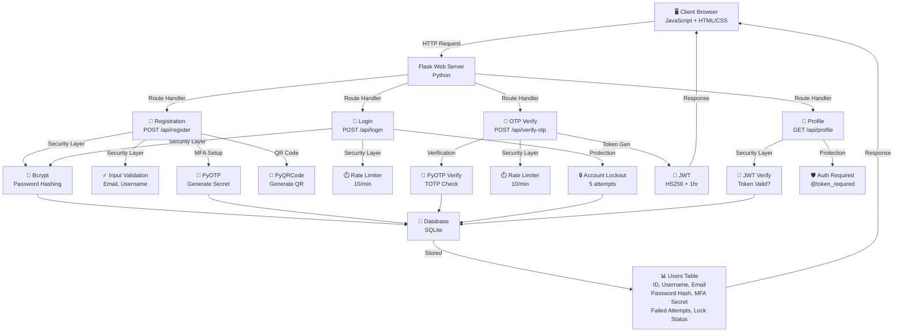
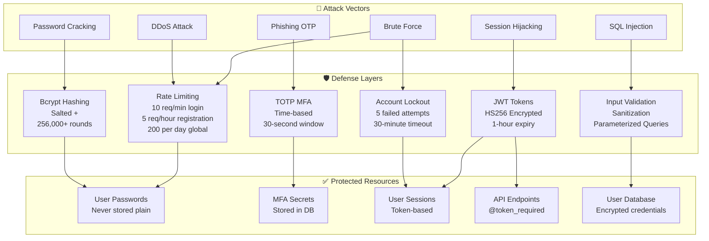
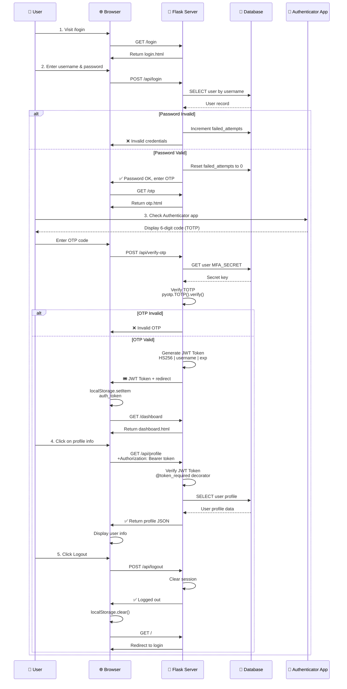
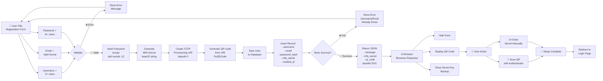
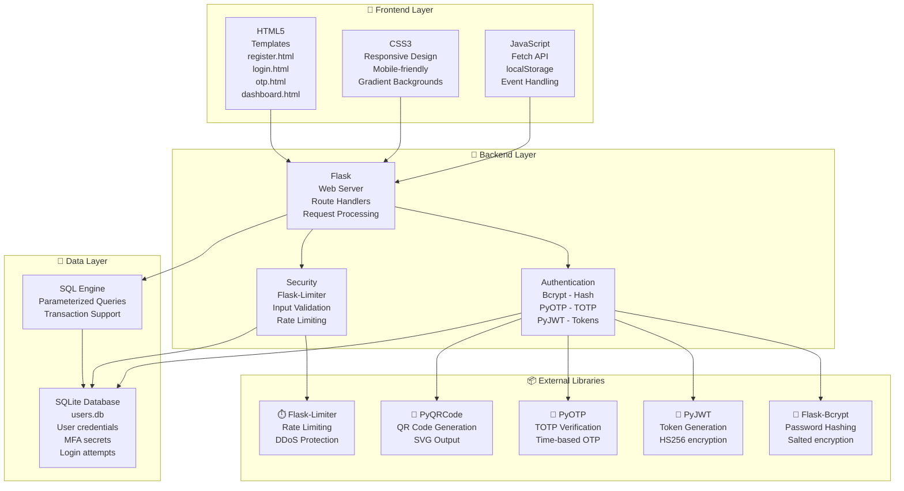

# 📊 System Diagrams - Secure Authentication System with MFA

This document contains all visual diagrams explaining how the authentication system works.

---

## 1. Complete Authentication Flow Diagram

```mermaid
graph TD
    A[User] -->|Visit Site| B{Choose Action}
    B -->|New User| C[/register]
    B -->|Existing User| D[/login]
    
    C -->|Enter Details| E["POST /api/register<br/>username, email, password"]
    E -->|Validate Input| F{Valid?}
    F -->|No| G["❌ Show Error"]
    G -->|Retry| E
    F -->|Yes| H["Hash Password<br/>bcrypt + salt"]
    H -->|Generate| I["Create MFA Secret<br/>pyotp.random_base32"]
    I -->|Generate| J["Create QR Code<br/>TOTP URI"]
    J -->|Store| K["Save to Database<br/>SQLite"]
    K -->|Display| L["📱 Show QR Code<br/>+ Secret Key"]
    L -->|Setup| M["User Scans with<br/>Authenticator App"]
    M -->|Ready| N[✅ Redirect to Login]
    
    D -->|Enter Credentials| O["POST /api/login<br/>username, password"]
    O -->|Check User| P{User Exists?}
    P -->|No| Q["❌ Invalid Credentials"]
    Q -->|Retry| O
    P -->|Yes| R{Account Locked?}
    R -->|Yes| S["❌ Account Locked<br/>30 min timeout"]
    S -->|Wait| O
    R -->|No| T["Verify Password<br/>bcrypt.check_password_hash"]
    T -->|Match?| U{Password Valid?}
    U -->|No| V["Increment Failed<br/>Attempts Counter"]
    V -->|5+ Attempts?| W{Lock Account?}
    W -->|Yes| X["🔒 Lock Account<br/>+ Timeout"]
    X -->|Show| S
    W -->|No| Y["Show Attempts Left"]
    Y -->|Retry| O
    U -->|Yes| Z["Reset Failed<br/>Attempts to 0"]
    Z -->|Store| AA["Session: username<br/>Session: user_id"]
    AA -->|Redirect| AB[/otp]
    
    AB -->|Enter 6-digit| AC["POST /api/verify-otp<br/>OTP Code"]
    AC -->|Get Secret| AD["Retrieve MFA Secret<br/>from Database"]
    AD -->|Verify| AE["Check TOTP Code<br/>pyotp.TOTP.verify"]
    AE -->|Valid?| AF{OTP Correct?}
    AF -->|No| AG["❌ Invalid OTP"]
    AG -->|Retry| AC
    AF -->|Yes| AH["Generate JWT Token<br/>HS256 + 1hr expiry"]
    AH -->|Store| AI["Save Token to<br/>localStorage"]
    AI -->|Clear Session| AJ["Wipe Session Data"]
    AJ -->|Redirect| AK[/dashboard]
    
    AK -->|Display| AL["🏠 Dashboard"]
    AL -->|Show Profile| AM["GET /api/profile<br/>Authorization: Bearer Token"]
    AM -->|Verify Token| AN{Valid Token?}
    AN -->|No| AO["❌ Redirect to Login"]
    AN -->|Yes| AP["Return User Data<br/>Profile Info"]
    AP -->|Display| AQ["✅ User Profile<br/>Security Status"]
    AQ -->|Action| AR{User Action?}
    AR -->|Logout| AS["POST /api/logout"]
    AS -->|Clear| AT["localStorage.clear"]
    AT -->|Redirect| AU[/login]
    AR -->|Stay| AQ
```

**Description**: This diagram shows the complete user journey from initial visit through registration, login, OTP verification, and dashboard access. It includes all decision points, error handling, and security checks.

---

## 2. System Architecture - Components & Data Flow



**Description**: Shows the high-level architecture with all components (Flask, security libraries, database) and how they interact with each other.

---

## 3. Security Layers - Attack Mitigation



**Description**: Maps different attack vectors to their corresponding defense mechanisms. Shows how each security measure protects specific resources.

---

## 4. Detailed Login Sequence - Client, Server & Database Interaction



**Description**: A detailed sequence diagram showing the exact interactions between user, browser, Flask server, database, and authenticator app at each step of the authentication process.

---

## 5. Registration Process - Step by Step



**Description**: Step-by-step walkthrough of the complete registration process including validation, password hashing, MFA secret generation, QR code creation, and database storage.

---

## 6. Technology Stack & Component Integration



**Description**: Shows how all the technology components are layered and integrated together, from frontend to backend to storage.

---

## 7. Security Deep Dive - TOTP & Bcrypt Encryption

```mermaid
graph TB
    subgraph TOTP["📱 TOTP (Time-Based One-Time Password) Process"]
        T1["1. Registration:"]
        T2["Generate Secret Key<br/>32 bytes base32"]
        T3["Display QR Code<br/>otpauth://totp/..."]
        T4["User Scans QR<br/>into Authenticator App"]
        
        T1 --> T2 --> T3 --> T4
        
        T5["2. Login - OTP Generation:"]
        T6["Authenticator App<br/>Starts Timer<br/>0-30 seconds"]
        T7["Uses HMAC-SHA1<br/>+ Current Unix Time<br/>+ Secret Key"]
        T8["Produces 6-Digit<br/>One-Time Code"]
        
        T5 --> T6 --> T7 --> T8
        
        T9["3. Verification:"]
        T10["Server Uses<br/>Same Secret Key<br/>+ Similar Time Window"]
        T11["Generates Expected<br/>TOTP Code"]
        T12["Compares with<br/>User's Entry"]
        T13["✅ Match = Success"]
        
        T9 --> T10 --> T11 --> T12 --> T13
    end
    
    subgraph Hash["🔐 Password Hashing with Bcrypt Process"]
        H1["User Password<br/>e.g., 'Pass@123'"]
        
        H2["Generate Random<br/>Salt<br/>16 bytes"]
        
        H3["Bcrypt Algorithm<br/>12 Rounds<br/>~250ms per hash"]
        
        H4["Combines<br/>Salt + Password<br/>+ Rounds"]
        
        H5["Hash Output<br/>Example:<br/>$2b$12$R9h7cIPz0gi..."]
        
        H6["Store in Database<br/>Never Plain Text!"]
        
        H1 --> H2 --> H3 --> H4 --> H5 --> H6
        
        H7["On Login:"]
        H8["User Enters<br/>Password Again"]
        H9["Extract Salt<br/>from Stored Hash"]
        H10["Re-hash<br/>with Same Salt"]
        H11["Compare Hashes<br/>bcrypt.check()"]
        H12["✅ Match = Valid"]
        
        H7 --> H8 --> H9 --> H10 --> H11 --> H12
    end
```



**Description**: Deep dive into the cryptographic processes - how TOTP generates time-based one-time passwords and how Bcrypt securely hashes passwords with salt.

---

## 📚 How to Use These Diagrams

1. **View in GitHub**: If viewing on GitHub, Mermaid diagrams render automatically
2. **Copy to Other Tools**: Copy the mermaid code blocks into:
   - [Mermaid Live Editor](https://mermaid.live)
   - VSCode with Markdown Preview
   - Confluence / Notion (with Mermaid support)
3. **Export**: Export diagrams as PNG, SVG, or PDF using Mermaid tools

---

## 🔑 Key Takeaways

| Diagram | Key Insight |
|---------|------------|
| Authentication Flow | Complete user journey with all security checks |
| System Architecture | How components interact and communicate |
| Security Layers | Defense mechanisms for different attack vectors |
| Sequence Diagram | Real-time interactions between all system parts |
| Registration Process | Step-by-step data flow during account creation |
| Tech Stack | Technology layers and component dependencies |
| TOTP & Bcrypt | Cryptographic foundations of the system |

---

**Created**: February 8, 2026  
**System**: Secure Authentication System with MFA v1.0.0
